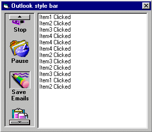



## Outlook Style Bar

### Description

Every ones seen the menu thingi in Outlook, well I decided to make one. So here it is, Its pretty simple but works well and looks good! You can put in as many images as you need with their actions. A great enhancment to an app and looks good!

CHECK IT OUT!!
 
### More Info
 

             |
---                |---
**Submitted On**   |2000-11-15 19:59:52
**By**             |[Andrew Stokes](https://github.com/Planet-Source-Code/PSCIndex/blob/master/ByAuthor/andrew-stokes.md)
**Level**          |Beginner
**User Rating**    |4.5 (45 globes from 10 users)
**Compatibility**  |VB 5\.0, VB 6\.0
**Category**       |[Custom Controls/ Forms/  Menus](https://github.com/Planet-Source-Code/PSCIndex/blob/master/ByCategory/custom-controls-forms-menus__1-4.md)
**World**          |[Visual Basic](https://github.com/Planet-Source-Code/PSCIndex/blob/master/ByWorld/visual-basic.md)
**Archive File**   |[CODE\_UPLOAD1171111152000\.zip](https://github.com/Planet-Source-Code/andrew-stokes-outlook-style-bar__1-12815/archive/master.zip)

